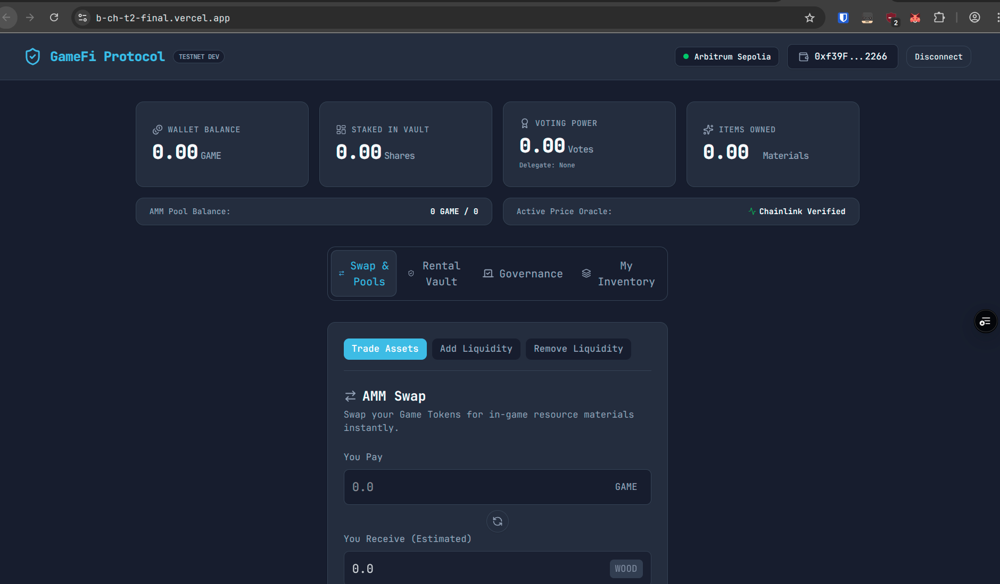
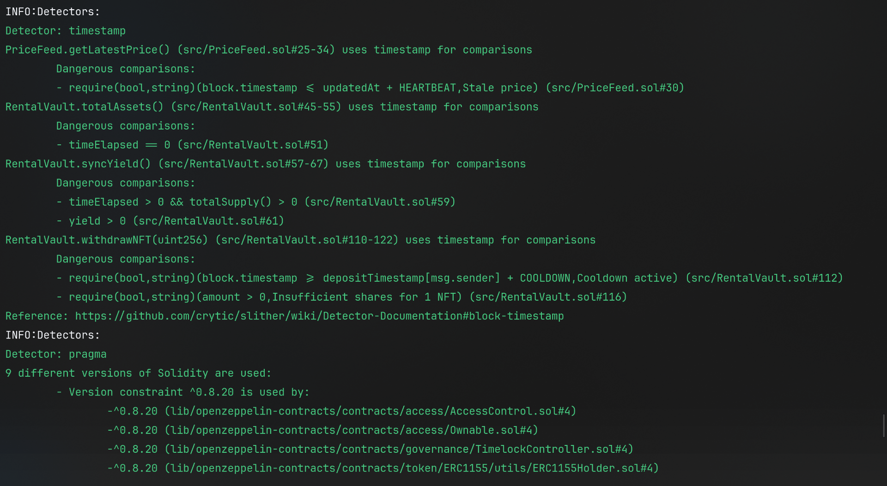
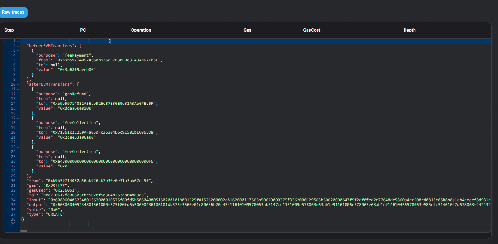

# GameFi Protocol

> A production-grade GameFi protocol featuring an ERC-1155 in-game item economy, constant-product AMM, ERC-4626 rental vault, Chainlink VRF loot drops, and DAO governance — deployed on **Arbitrum Sepolia (L2)**.



---

## Table of Contents

- [Overview](#overview)
- [Architecture](#architecture)
- [Deployed Contracts (Arbitrum Sepolia)](#deployed-contracts-arbitrum-sepolia)
- [Smart Contracts](#smart-contracts)
- [Test Suite](#test-suite)
- [Getting Started](#getting-started)
- [Local Development](#local-development)
- [L2 Deployment](#l2-deployment)
- [Frontend](#frontend)
- [Subgraph (The Graph)](#subgraph-the-graph)
- [Security](#security)
- [Project Structure](#project-structure)

---

## Overview

GameFi Protocol is a fully on-chain gaming economy built on Arbitrum Sepolia. Players can:

- **Trade** ERC-1155 game items on a custom constant-product AMM with a 0.3% fee
- **Rent** NFT items via an ERC-4626 vault earning yield, priced by a live Chainlink ETH/USD oracle
- **Open loot boxes** using provably fair randomness via Chainlink VRF
- **Govern** the protocol through an OpenZeppelin Governor DAO with a Timelock
- **Craft** items by combining multiple resource types under on-chain recipes

---

## Architecture

```
┌─────────────────────────────────────────────────────────┐
│                    React Frontend (Vite)                  │
│              RainbowKit · Wagmi · Ethers.js               │
└───────────────────────┬─────────────────────────────────┘
                        │
              ┌─────────▼──────────┐
              │  Arbitrum Sepolia  │
              │       (L2)         │
              └─────────┬──────────┘
                        │
        ┌───────────────┼────────────────────┐
        │               │                    │
   ┌────▼─────┐   ┌─────▼──────┐   ┌────────▼───────┐
   │GameToken │   │  GameItem  │   │   GameAMM      │
   │ ERC-20   │   │ ERC-1155   │   │  Constant AMM  │
   │ + Votes  │   │ + Crafting │   │  0.3% fee      │
   └──────────┘   └────────────┘   └────────────────┘
        │               │                    │
   ┌────▼──────────┐  ┌─▼──────────┐  ┌─────▼──────────┐
   │ GameGovernor  │  │RentalVault │  │   LootVRF      │
   │ OZ Governor   │  │ ERC-4626   │  │ Chainlink VRF  │
   └────┬──────────┘  └────────────┘  └────────────────┘
        │                    │
   ┌────▼──────────┐  ┌─────▼──────────┐
   │ GameTimelock  │  │   PriceFeed    │
   │ TimelockCtrl  │  │ Chainlink ETH/ │
   └───────────────┘  │    USD Oracle  │
                      └────────────────┘
                              │
              ┌───────────────▼─────────────┐
              │  The Graph Subgraph Indexer  │
              │  (Proposals, Swaps, Rents)   │
              └─────────────────────────────┘
```

---

## Deployed Contracts (Arbitrum Sepolia)

All contracts are verified on [Arbiscan Sepolia](https://sepolia.arbiscan.io/).

| Contract | Address | Arbiscan |
|---|---|---|
| `GameToken` | `0x491707829CE7b07227C40A61C781dB6ddDDD3683` | [View ↗](https://sepolia.arbiscan.io/address/0x491707829CE7b07227C40A61C781dB6ddDDD3683#code) |
| `GameItem` | `0xA710612fe06503CBc502Ef5A364b253c804BD3d5` | [View ↗](https://sepolia.arbiscan.io/address/0xA710612fe06503CBc502Ef5A364b253c804BD3d5#code) |
| `PriceFeed` | `0xb4719C9C05D6e7E81007824EEcdbe03f9435c337` | [View ↗](https://sepolia.arbiscan.io/address/0xb4719C9C05D6e7E81007824EEcdbe03f9435c337#code) |
| `GameAMM` | `0x2082b95707B5567964be85e75355e96B7b2e408B` | [View ↗](https://sepolia.arbiscan.io/address/0x2082b95707B5567964be85e75355e96B7b2e408B#code) |
| `RentalVault` | `0x8d7A7217fb714624c215b9a6925a3c9fdAD94D07` | [View ↗](https://sepolia.arbiscan.io/address/0x8d7A7217fb714624c215b9a6925a3c9fdAD94D07#code) |
| `GameTimelock` | `0xb126D03D6D3426D85a6F77B2110D6E5a15e9F377` | [View ↗](https://sepolia.arbiscan.io/address/0xb126D03D6D3426D85a6F77B2110D6E5a15e9F377#code) |
| `GameGovernor` | `0x155f0844eC55E454918AE043dDF2f4b976CC1b80` | [View ↗](https://sepolia.arbiscan.io/address/0x155f0844eC55E454918AE043dDF2f4b976CC1b80#code) |
| `LootVRF` | `0x46518134D22fce2A5314F8326f11B616C8d76455` | [View ↗](https://sepolia.arbiscan.io/address/0x46518134D22fce2A5314F8326f11B616C8d76455#code) |

> **Network:** Arbitrum Sepolia (Chain ID: `421614`)  
> **RPC:** `https://sepolia-rollup.arbitrum.io/rpc`

---

## Smart Contracts

### `GameToken.sol` — ERC-20 Governance Token
- Standard ERC-20 with `ERC20Votes` extension for on-chain voting power
- Minting restricted to `MINTER_ROLE`
- Used as the native protocol currency and governance token

### `GameItem.sol` — ERC-1155 In-Game Items
- Multi-token standard supporting 10 fungible resource types
- On-chain crafting recipes: burn inputs, receive output
- Role-based minting/burning (`MINTER_ROLE`, `BURNER_ROLE`)
- Pausable by `DEFAULT_ADMIN_ROLE`

### `GameAMM.sol` — Constant-Product AMM
- Uniswap V2-style x·y=k swap formula
- 0.3% fee implemented via precision-preserving integer math (multiply-then-divide)
- Reentrancy-protected with `nonReentrant`
- Supports `addLiquidity`, `removeLiquidity`, `swap`, `getAmountOut`

### `RentalVault.sol` — ERC-4626 NFT Rental Vault
- Lenders deposit ERC-1155 items and receive ERC-4626 yield-bearing shares
- Borrowers rent items for a duration; rent priced by live Chainlink ETH/USD oracle
- Interest accrues and distributes yield to share holders

### `PriceFeed.sol` — Chainlink Oracle Adapter
- Wraps AggregatorV3Interface for the ETH/USD price feed
- Used by `RentalVault` to compute fair rental rates

### `LootVRF.sol` — Chainlink VRF Loot Drops
- Requests verifiable randomness from Chainlink VRF V2
- On fulfillment, mints random ERC-1155 items to the requesting user
- Provably fair — randomness cannot be manipulated

### `GameGovernor.sol` + `GameTimelock.sol` — DAO Governance
- OpenZeppelin `Governor` with `GovernorVotes`, `GovernorTimelockControl`
- Proposals require voting power from `GameToken` delegation
- All governance executions pass through a `TimelockController`
- Voting delay: 1 block | Voting period: 50400 blocks (~1 week) | Quorum: 4%

---

## Test Suite

91 tests across 7 suites — all passing.

| Suite | Type | Tests |
|---|---|---|
| `GameItem.t.sol` | Unit | 23 |
| `GameAMM.t.sol` | Unit | 18 |
| `GameFiExtra.t.sol` | Unit | 20+ |
| `GovernanceE2E.t.sol` | Integration | 6 |
| `Fuzz.t.sol` | Fuzz (256 runs each) | 10 |
| `Invariants.t.sol` | Invariant (256 runs each) | 5 |
| `Fork.t.sol` | Fork (Arbitrum Sepolia) | 3 |

**Invariants verified:**
- `k` product (`reserveX × reserveY`) never decreases after a swap
- LP share supply always corresponds proportionally to reserves
- Reserve tracking always matches actual token balances
- `GameToken` total supply never decreases unexpectedly

**Static Analysis:**



```bash
slither . --exclude-dependencies
# INFO:Slither: analyzed (79 contracts with 101 detectors)
# Zero HIGH or CRITICAL findings in src/ contracts
```

---

## Getting Started

### Prerequisites

- [Foundry](https://book.getfoundry.sh/getting-started/installation) — `curl -L https://foundry.paradigm.xyz | bash`
- [Node.js ≥ 18](https://nodejs.org/)
- [just](https://github.com/casey/just) — `cargo install just` or `brew install just`

### Clone & Install

```bash
git clone <your-repo-url>
cd gamefi-protocol

# Install Foundry dependencies and frontend node_modules
just install
```

### Configure environment

```bash
cp .env.example .env
# Edit .env and fill in:
#   PRIVATE_KEY=<your wallet private key>
#   RPC_URL=https://sepolia-rollup.arbitrum.io/rpc
#   ARBISCAN_API_KEY=<your arbiscan api key>
```

---

## Local Development

```bash
# 1. Start the local Anvil node (in a separate terminal)
just node

# 2. Deploy all contracts to Anvil
just deploy

# 3. Sync contract addresses to the frontend
just sync-addresses

# 4. Start the frontend dev server
just dev
# → http://localhost:5173
```

### Useful local commands

```bash
just test              # Run the full test suite
just coverage          # Generate coverage report
just format            # Format all Solidity with forge fmt
just pre-push          # Run ALL checks before pushing (fmt + test + lint)

just fund-eth 0xYOUR_ADDRESS       # Send 10 ETH to address
just mint-game 0xYOUR_ADDRESS 500  # Mint 500 GAME tokens
just give-items 0xYOUR_ADDRESS     # Give 100 of each item type
```

---

## L2 Deployment

To deploy to **Arbitrum Sepolia** (live L2):

```bash
# Ensure .env has your funded PRIVATE_KEY
just deploy-l2

# Verify contracts on Arbiscan
forge verify-contract <ADDRESS> src/GameToken.sol:GameToken \
  --chain arbitrum-sepolia \
  --etherscan-api-key $ARBISCAN_API_KEY

# Run post-deployment verification checks
forge script script/VerifyDeployment.s.sol \
  --rpc-url https://sepolia-rollup.arbitrum.io/rpc
```

### Run the Governance Lifecycle Demo

End-to-end on-chain DAO demo (propose → vote → queue → execute):

```bash
forge script script/GovernanceLifecycleDemo.s.sol \
  --rpc-url https://sepolia-rollup.arbitrum.io/rpc \
  --broadcast
```

On-chain transaction log evidence:



---

## Frontend

The React frontend connects to Arbitrum Sepolia via RainbowKit wallet integration.

```bash
cd frontend
npm install
npm run dev       # Development server at http://localhost:5173
npm run build     # Production build
npm run lint      # ESLint check
```

### Features
- **AMM Swap Panel** — swap between `GameToken` and any resource item with live price preview
- **Items Dashboard** — view all 10 ERC-1155 item balances
- **Rental Vault** — deposit/withdraw NFTs and pay rent with Chainlink oracle pricing
- **Loot VRF** — trigger Chainlink VRF loot drops
- **Governance Console** — delegate votes, view proposals, connect to subgraph indexer

### Vercel Deployment

[](https://b-ch-t2-final.vercel.app/)

When deploying on Vercel, set the following environment variable:

| Variable | Value |
|---|---|
| `VITE_SUBGRAPH_URL` | Your Graph Studio query URL |

---

## Subgraph (The Graph)

The protocol events are indexed via a deployed Graph Studio subgraph.

**Indexed entities:** `ProposalCreated`, `TokensSwapped`, `ItemRented`, `LootDropped`

### Deploy the subgraph

```bash
cd subgraph
npm install

# Authenticate with your Graph Studio deploy key
graph auth --studio <DEPLOY_KEY>

# Generate TypeScript types from schema
npm run codegen

# Build and deploy
npm run build
npm run deploy
```

### Query example

```graphql
query {
  proposals(orderBy: startBlock, orderDirection: desc, first: 10) {
    id
    proposer
    description
    status
    startBlock
    endBlock
  }
}
```

Test your endpoint directly:

```bash
curl -X POST \
  -H "Content-Type: application/json" \
  -d '{"query": "{ proposals(first: 5) { id status } }"}' \
  https://api.studio.thegraph.com/query/<YOUR_ID>/gamefi-protocol/version/latest
```

---

## Security

- **Checks-Effects-Interactions** pattern enforced on all state-changing functions
- **ReentrancyGuard** on `swap`, `addLiquidity`, `removeLiquidity`, `rentNFT`
- **SafeERC20** used for all token interactions
- **AccessControl** roles (`MINTER_ROLE`, `BURNER_ROLE`, `DEFAULT_ADMIN_ROLE`) enforced with no implicit admin escapes
- **Timelock** on all governance execution — no instant admin actions
- **Divide-before-multiply** precision issue resolved: AMM fee math uses scaled integer arithmetic (`amountIn * 997`, divide once at the end)
- Slither static analysis: **zero HIGH or CRITICAL** findings in custom contracts

---

## Project Structure

```
gamefi-protocol/
├── src/                    # Solidity source contracts
│   ├── GameToken.sol       # ERC-20 + ERC20Votes
│   ├── GameItem.sol        # ERC-1155 items + crafting
│   ├── GameAMM.sol         # Constant-product AMM
│   ├── RentalVault.sol     # ERC-4626 NFT rental vault
│   ├── PriceFeed.sol       # Chainlink oracle adapter
│   ├── LootVRF.sol         # Chainlink VRF loot drops
│   ├── GameGovernor.sol    # OZ Governor DAO
│   ├── GameTimelock.sol    # Timelock controller
│   └── GameItemFactory.sol # CREATE2 item factory
├── test/                   # Forge test suite (91 tests)
├── script/                 # Deployment & management scripts
├── subgraph/               # The Graph subgraph
├── frontend/               # React + Wagmi dApp
├── report/                 # Architecture & security report
│   └── img/                # Screenshots
├── deployments/            # Deployment artifacts (JSON)
├── Justfile                # Developer task runner
└── foundry.toml            # Foundry configuration
```

---

## License

MIT
