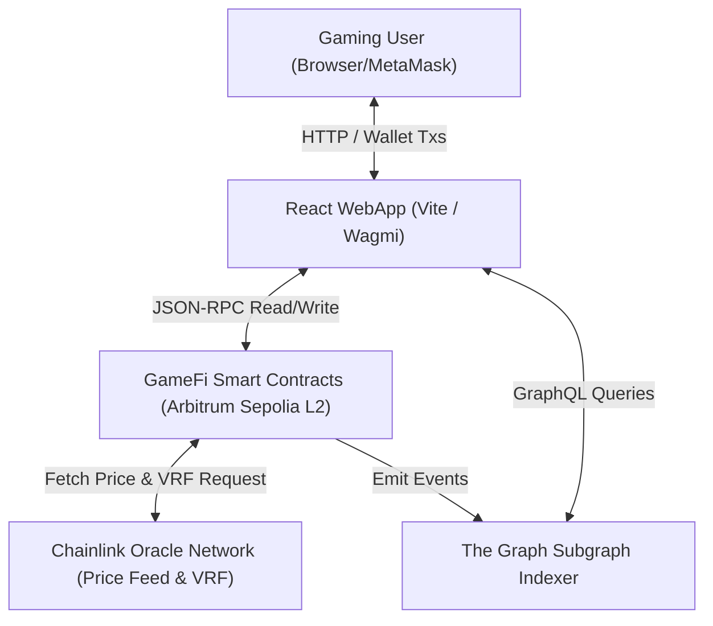
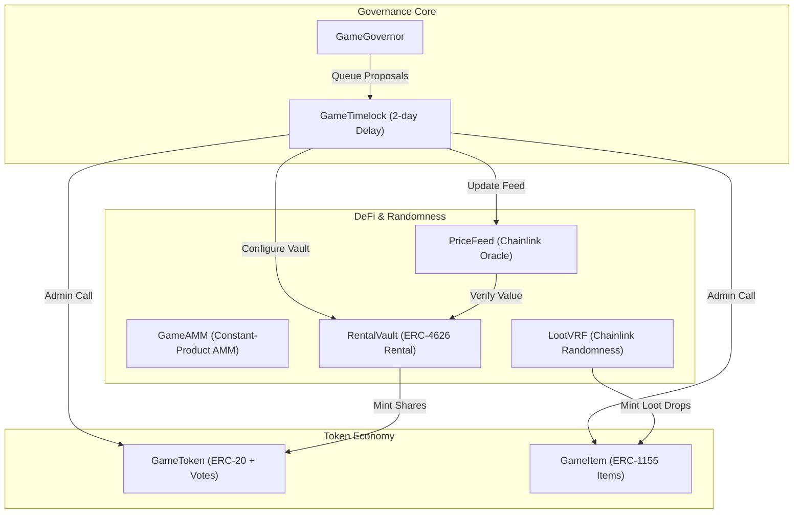
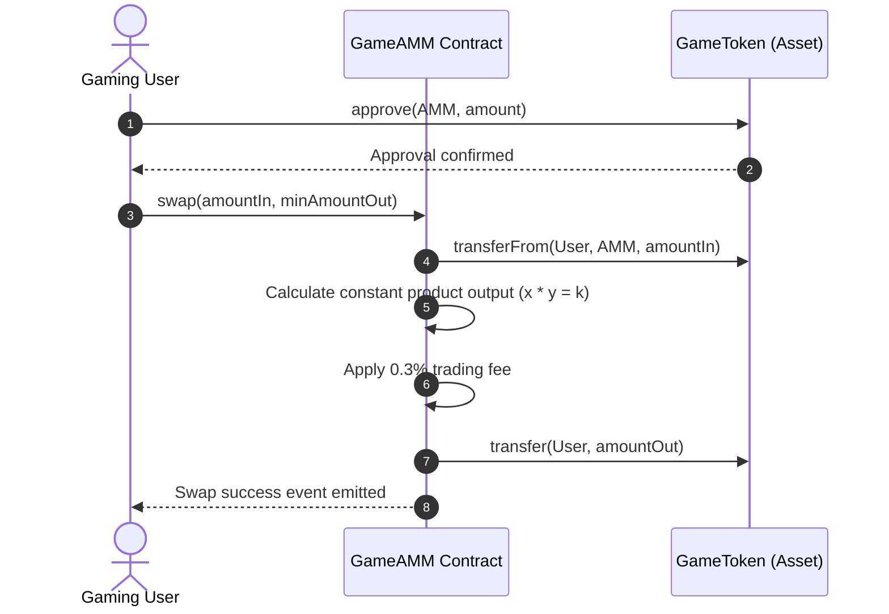
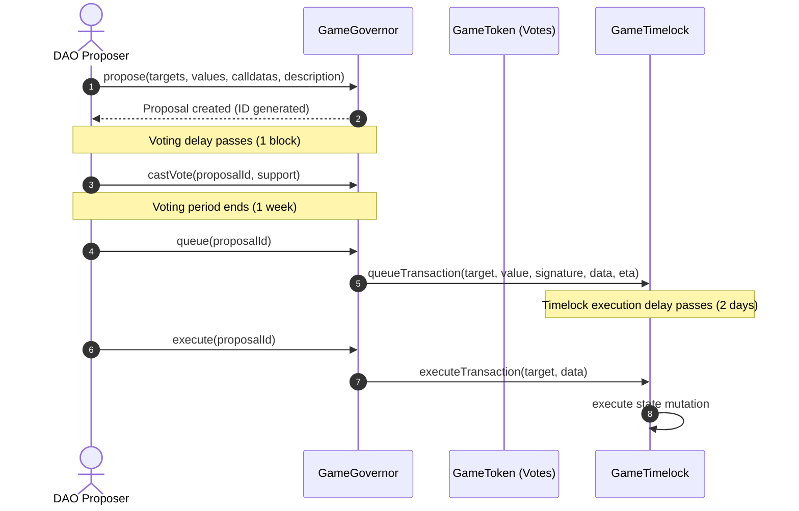
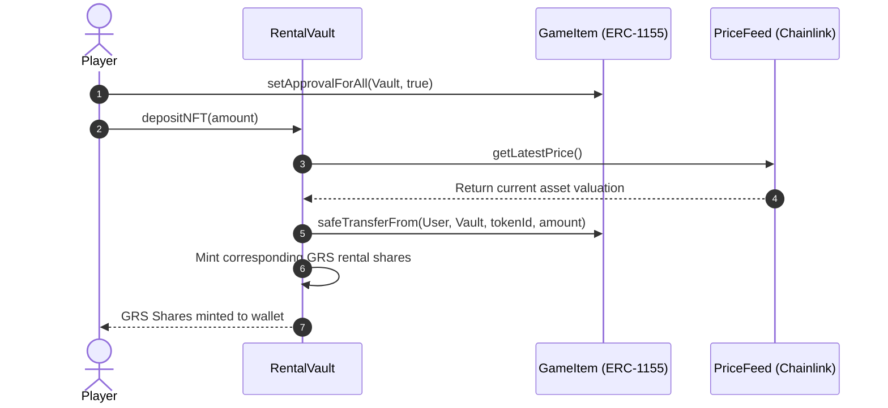

# GameFi Protocol Architecture Document

Welcome to the official technical design and architecture guide for the **GameFi Protocol**. This document details the system design, components, sequence flows, data models, trust assumptions, and Architectural Decision Records (ADRs) powering the L2 gaming economy.

For a publication-grade academic layout of this document, please refer to the compiled PDF at: [report.pdf](../report/report.pdf).

---

## 1. System Context Diagram (C4 Level 1)

This diagram shows the boundary interaction between the gaming user, the protocol, and external systems like the Chainlink oracle network and the Graph querying indexing protocol:

---

## 2. Container Diagram (C4 Level 2)

The core architecture consists of eight primary smart contracts:

---

## 3. Component & Storage Layout (C4 Level 3)

All contracts are strictly non-upgradeable to eliminate proxy state-collision risks and governance backdoors. The storage layouts are explicitly defined under Solidity 0.8.24:

### 3.1 `GameItem.sol` Storage Matrix
* **Slot 0:** `bytes32 public constant MINTER_ROLE`
* **Slot 1:** `bytes32 public constant BURNER_ROLE`
* **Slot 2:** `bytes32 public constant PAUSER_ROLE`
* **Slot 3:** `uint256 public itemIdCounter`
* **Slot 4:** `mapping(uint256 => string) public itemMetadata`
* **Slot 5:** `mapping(uint256 => Recipe) public recipes`
* **Slot 6:** `uint256 public recipeCount`

### 3.2 `RentalVault.sol` Storage Matrix
* **Slot 0:** `IERC1155 public immutable gameItem` (Immutable - does not consume slot storage)
* **Slot 1:** `uint256 public immutable targetTokenId` (Immutable)
* **Slot 2:** `uint256 public lastYieldUpdate`
* **Slot 3:** `uint256 public yieldRate`
* **Slot 4:** `mapping(address => uint256) public depositTimestamp`

---

## 4. Sequence Diagrams for Critical User Flows

### 4.1 Flow 1: Resource Asset Swap (GameAMM)
The flow below illustrates a user swapping asset tokens for custom crafted resources:

### 4.2 Flow 2: Propose-Vote-Execute Governance Loop
This is the complete decentralization lifecycle of a DAO proposal:

### 4.3 Flow 3: NFT Rental Vault Deposit & Yield Simulation
Staking weapon skins to generate ERC-4626 vault shares, pulling oracle valuations, and borrowing:

---

## 5. Trust Assumptions & Governance Matrix

* **Root Authority:** The `GameTimelock` holds 100% root control over administrative functions. No developers, founders, or individual addresses hold private admin backdoors.
* **Multisig Recovery:** In the event of a multisig key compromise, the **2-day safety delay** enforced by the Timelock prevents immediate treasury drainage, allowing the community to coordinate defensive forks.
* **Decentralization Metric:** The protocol operates at **Level 2 (High Independence)** maturity.

---

## 6. Architectural Decision Records (ADRs)

### ADR-01: Unified ERC-1155 standard for Resource Assets
* **Context:** In-game crafting systems require multiple item types (fungible materials, non-fungible weapons).
* **Options Considered:** 
  1. Multiple separate ERC-20 and ERC-721 contracts.
  2. Single unified ERC-1155 contract.
* **Decision:** Option 2.
* **Consequences:** Decreases contract deployment footprint and reduces user gas fees by up to 85% due to batch minting operations.

### ADR-02: Non-Upgradeable Core Contracts
* **Context:** High-security risks associated with upgradeable smart contracts (Transparent vs UUPS storage collision vectors).
* **Options Considered:** Standard upgradeable proxies vs immutable structures.
* **Decision:** Fully immutable structures, utilizing AccessControl roles strictly bound to the `GameTimelock`.
* **Consequences:** Eliminates backdoor exploit vectors and guarantees absolute predictability of protocol storage layouts.

### ADR-03: Chainlink VRF for Fair Loot boxes
* **Context:** In-game drop box logic requires provably fair randomness.
* **Options Considered:** `block.prevrandao` vs Chainlink VRF.
* **Decision:** Chainlink VRF.
* **Consequences:** Mitigates block-producer extraction risks (MEV) and guarantees mathematically auditable transparency.

### ADR-04: ERC-4626 Standard Choice for Vault Rental Shares
* **Context:** The NFT Rental system requires a unified yield-bearing token share format.
* **Decision:** ERC-4626.
* **Consequences:** Standardizes share token behavior and integrates cleanly with external yield protocols.
